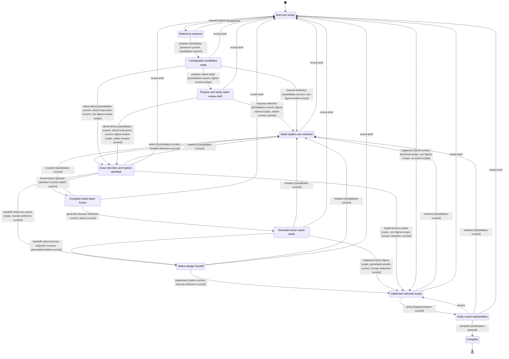

<!-- GENERATED by tools/sync_workflow.py; edit library/workflow.json only. -->
# Canonical production workflow

Graph SHA256: `79e971e26d24f726f545aa6ae534b48ff65b41f0be2a8038a2cc333da2fe893e`

```mermaid
stateDiagram-v2
    [*] --> brief
    state "Brief and scope" as brief
    state "Reference research" as research
    state "Comparable candidates ready" as selection_ready
    state "Prepare and verify native review draft" as native_review_pending
    state "Await explicit user selection" as awaiting_user_selection
    state "Exact direction and hashes admitted" as selected
    state "Complete asset batch frozen" as batch_frozen
    state "Generate frozen asset batch" as generation
    state "Native design handoff" as native
    state "Implement selected scope" as implementation
    state "Verify current deliverables" as verification
    state "Complete" as complete
    complete --> [*]
    brief --> research: research [brief-current]
    research --> selection_ready: prepare-candidates [research-current, candidates-current]
    selection_ready --> native_review_pending: prepare-native-draft [candidates-current, figma-review-scope]
    native_review_pending --> awaiting_user_selection: request-selection [candidates-current, figma-review-scope, native-review-current]
    native_review_pending --> brief: revise-brief
    selection_ready --> awaiting_user_selection: request-selection [candidates-current, non-figma-review-scope]
    awaiting_user_selection --> selected: select [candidates-current, human-selection-current]
    selected --> batch_frozen: freeze-batch [human-selection-current, batch-current]
    batch_frozen --> generation: generate [human-selection-current, batch-current]
    generation --> native: handoff-native [human-selection-current, generated-assets-current]
    selected --> native: handoff-native [no-asset-scope, human-selection-current]
    native --> implementation: implement [native-current, human-selection-current]
    generation --> implementation: implement [non-figma-scope, generated-assets-current, human-selection-current]
    selected --> implementation: implement [no-asset-scope, non-figma-scope, human-selection-current]
    brief --> implementation: implement [brief-current, technical-scope, non-figma-scope, no-asset-scope]
    implementation --> verification: verify [implementation-current]
    verification --> complete: complete [verification-passed]
    verification --> implementation: rework
    selected --> awaiting_user_selection: reselect [candidates-current]
    batch_frozen --> awaiting_user_selection: reselect [candidates-current]
    generation --> awaiting_user_selection: reselect [candidates-current]
    native --> awaiting_user_selection: reselect [candidates-current]
    implementation --> awaiting_user_selection: reselect [candidates-current]
    verification --> awaiting_user_selection: reselect [candidates-current]
    research --> brief: revise-brief
    selection_ready --> brief: revise-brief
    awaiting_user_selection --> brief: revise-brief
    selected --> brief: revise-brief
    batch_frozen --> brief: revise-brief
    generation --> brief: revise-brief
    native --> brief: revise-brief
    implementation --> brief: revise-brief
    verification --> brief: revise-brief
    selection_ready --> selected: admit-direct [candidates-current, direct-instruction-current, non-figma-review-scope]
    native_review_pending --> selected: admit-direct [candidates-current, direct-instruction-current, figma-review-scope, native-review-current]

```
